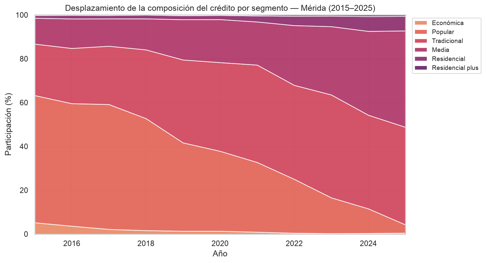
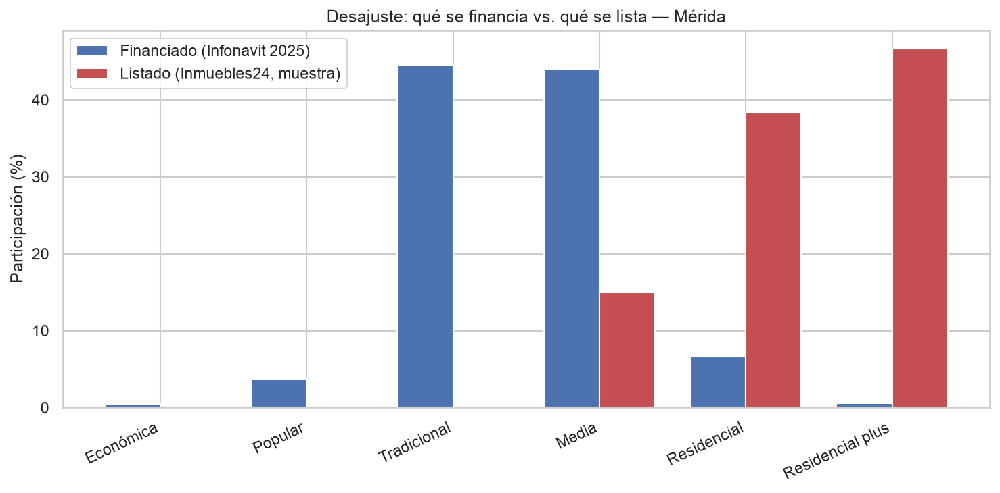

# Hallazgos — Vivienda formal en Mérida (2015–2025)

> Síntesis del análisis (Fase 4). Reúne los cuatro bloques del EDA en una lectura de acceso y
> desajuste de mercado. Es la semilla del reporte final (Fase 6).

## Pregunta y respuesta breve

**¿Se está desajustando la compra de vivienda vía crédito formal (Infonavit) en Mérida?**

Sí, en dos sentidos. Primero, el crédito formal se **desplazó hacia vivienda de mayor valor** y
abandonó casi por completo el segmento bajo. Segundo, en la franja alta de la oferta que pudimos
observar, el crédito **no alcanza** los precios listados. El financiamiento formal se concentra
hoy en la **vivienda media** (segmentos tradicional y media, ~\$0.7–2.6 M); por debajo y por
encima de esa banda, el crédito formal es delgado. Con matices importantes (ver Limitaciones).

## Hallazgos por bloque

**1. Desplazamiento hacia mayor valor.** La composición del crédito pasó de estar dominada por
Popular (58% en 2015) a concentrarse en Tradicional (44%) y Media (44%) en 2025; Popular
descendió a ~4% y Económica prácticamente desapareció. En número de créditos: Popular −96% y
Económica −94%; Media +155% y Residencial +262%.

**2. Flujo y tope del crédito.** El flujo total casi se duplicó (\$1.70 → \$3.50 mil millones de
pesos, +106%). El crédito promedio asciende con el segmento… salvo en residencial plus (~\$378 K),
donde el tope del crédito Infonavit hace que el monto subestime el valor de la vivienda.

**3. Traducción a pesos y comparabilidad.** En 2025, tradicional ≈ \$0.69–1.20 M y media ≈
\$1.20–2.58 M. Las fronteras de segmento subieron +61% en la década, pero los precios de la
vivienda (Índice SHF; el sureste entre las regiones más apreciadas, con Yucatán acelerándose
desde 2020) crecieron más rápido. Por eso **una parte del desplazamiento es reclasificación
(artefacto), no solo movimiento real del mercado.**

**4. Desajuste oferta–crédito.** El financiamiento se concentra en Tradicional + Media (88.5% en
2025, < \$2.58 M); la muestra de oferta cae en Residencial + Residencial plus (85%, > \$2.58 M).
Las dos distribuciones casi no se traslapan: el crédito formal se queda por debajo de lo listado.

## Lectura de acceso

- **Trabajador de bajos ingresos:** el crédito formal para vivienda económica/popular casi
  desapareció. Sea porque esa oferta se contrajo o porque el comprador dejó de acceder, el
  **acceso en la base se deterioró.**
- **Mercado medio:** ahí se concentra hoy el crédito Infonavit (~\$0.7–2.6 M). Es el punto dulce
  del financiamiento formal.
- **Gama alta:** la oferta observada supera lo que el crédito alcanza; ese segmento depende de
  recursos propios u otra banca, no del Infonavit.

**Implicaciones.** Un desarrollador que apunte a demanda financiada por Infonavit debería ubicar
su producto en la banda tradicional/media. Para política de vivienda, la casi desaparición del
financiamiento económico/popular es una señal de alerta sobre el acceso de los hogares de menores
ingresos.

## Limitaciones

- **Dato agregado:** sin transacciones individuales; el análisis es de estructura y distribución,
  no de propiedades.
- **"No disponible" (28.5% de los créditos)** se excluyó del análisis de valor (no corresponde a
  compra de vivienda).
- **`monto` es crédito, no valor;** subestima en la gama alta por el tope del crédito.
- **Comparabilidad intertemporal:** parte del desplazamiento es artefacto de umbrales que no
  siguieron el ritmo de los precios.
- **Oferta:** muestra chica (60), medio-alta por construcción y con precios de lista; describe la
  franja alta, no todo el mercado de Mérida.
- **Pendiente:** el perfil del acreditado (ingreso, edad; Datos Masivos del SII) enriquecería la
  lectura de acceso; quedó pendiente por indisponibilidad del servicio.
- **Alcance:** análisis descriptivo y asociativo, no causal.

## Qué sigue

Validación (Fase 5) y reporte final (Fase 6). Con una muestra de oferta representativa y el perfil
del acreditado, la lectura de acceso pasaría de direccional a concluyente.

---

*Figuras completas en `outputs/`: composición y desplazamiento, flujo de crédito, crédito
promedio por segmento, bandas de valor 2025, recorrido de fronteras, desajuste y precios vs.
bandas.*
